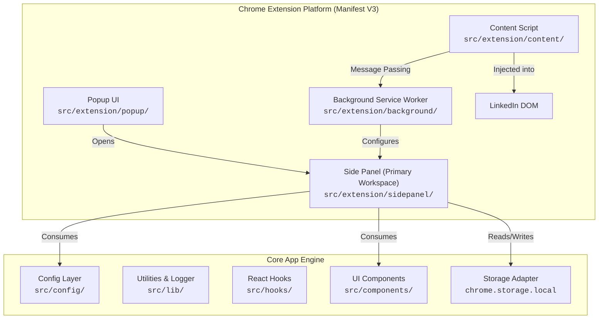

# PostKit V2 Architecture Documentation

## Architecture Overview

PostKit V2 is engineered with a **feature-first, modular architecture** that separates Chrome Extension surface bindings from React application logic.

---

## Extension Surfaces

1. **Background Service Worker (`src/extension/background/`)**
   - Configures side panel behavior (`openPanelOnActionClick: true`).
   - Listens to extension lifecycle events.
   - Central message bus for inter-surface communication.

2. **Side Panel (`src/extension/sidepanel/`) — *Primary Workspace***
   - Main persistent UI where users compose and generate posts.
   - Built with React 19 + Tailwind CSS v4 design system.

3. **Content Script (`src/extension/content/`)**
   - Injected into `https://www.linkedin.com/*`.
   - Interacts directly with LinkedIn's post composer modal.

4. **Popup (`src/extension/popup/`)**
   - Lightweight quick trigger UI to open the Side Panel workspace.

---

## Core Systems & Utilities

- **Environment Config (`src/config/env.config.ts`)**: Safe accessor for Groq API key and Ollama local endpoint.
- **Logger (`src/lib/logger.ts`)**: Production-safe logger that suppresses debug output in production.
- **Error Handler (`src/lib/errorHandler.ts`)**: Centralized `AppError` class with observer pattern listeners.
- **Storage Adapter (`src/lib/storage.ts`)**: Strongly typed wrapper for `chrome.storage.local` with `localStorage` web fallback.
