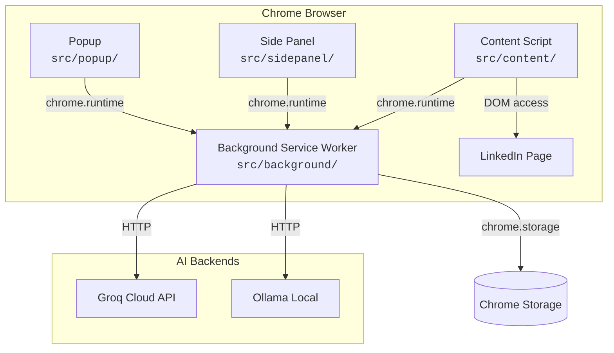

# PostKit Architecture

## Extension Surfaces

PostKit uses four Chrome Extension surfaces:

### Background Service Worker (`src/background/`)

- Extension lifecycle management
- Side panel behavior configuration
- Message routing between surfaces
- AI API calls (future)
- Chrome Storage operations

### Popup (`src/popup/`)

- Quick-access UI when clicking the extension icon
- Lightweight — opens side panel for full workflow

### Side Panel (`src/sidepanel/`)

- **Primary workspace** — where post creation happens
- Persistent panel alongside the browser window
- Full React application with post editor, AI generation, preview

### Content Script (`src/content/`)

- Injected into `linkedin.com` pages
- Future: read post context, inject composed posts, interact with LinkedIn's editor

---

## Data Flow

1. **User opens PostKit** → side panel opens via background worker
2. **User creates post** → side panel UI captures input
3. **AI generation** → background worker calls Groq/Ollama API
4. **Post preview** → side panel renders formatted preview
5. **Publish** → content script interacts with LinkedIn page (future)

---

## State Management

- **Chrome Storage** (`chrome.storage.local`) — persists user settings, drafts, and templates
- **React State** — ephemeral UI state within each surface
- **No global state library** — Chrome Storage serves as the cross-surface data layer

---

## Communication

All inter-surface communication uses Chrome's built-in messaging:

- `chrome.runtime.sendMessage` — one-shot messages
- `chrome.runtime.connect` — persistent connections (if needed)
- `chrome.storage.onChanged` — reactive storage updates
